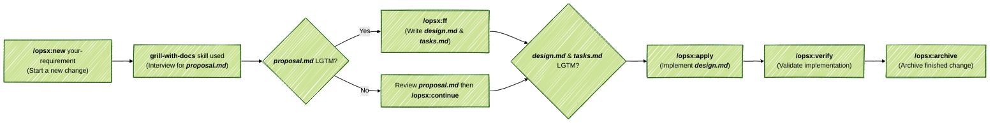

# SpecKit

**SpecKit** is a lightweight and opinionated AI-driven application development boilerplate. It provides out-of-the-box (OOTB) support for both Greenfield (new) and Brownfield (existing) projects with a set of best practices. **What's included?**

- **[OpenCode](https://github.com/anomalyco/opencode)** - Model-agnostic agent orchestration.

  - [Oh-my-opencode-slim](https://github.com/alvinunreal/oh-my-opencode-slim) - A Multi-Agent System (MAS) for OpenCode, featuring a specialized agent team built-in to scan codebases, fetch docs, audit architecture, build UI, and run scoped implementation tasks via a single orchestrator. Meet your team below (***Ref*** [Meet the Pantheon](https://github.com/alvinunreal/oh-my-opencode-slim#meet-the-pantheon)):
    - ***Orchestrator*** - Plans, schedules background specialists, reconciles results, and verifies outcomes.
    - ***Explorer*** - Handles broad scouting work with speed.
    - ***Oracle*** - Works on architecture, hard debugging, trade-offs, and code review.    
    - ***Council*** - Sends your question to multiple models in parallel, gathers their competing judgments, and distills the strongest ideas into a single verdict.
    - ***Librarian*** - Handles research and documentation lookups, emphasizing speed and efficiency.
    - ***Designer*** - Focuses on UI/UX judgment, frontend implementation, and visual polish.
    - ***Fixer*** - Works on execution tasks and straightforward code changes based on a concrete plan or bounded instructions from ***Orchestrator***.

- **[OpenSpec](https://github.com/Fission-AI/openspec)** - A spec-driven development framework with **an opinionated workflow** - `speckit`.


### 1. Installation

*Paste* the following instructions in `OpenCode`.

```text
Fetch and follow instructions from https://raw.githubusercontent.com/jimzhan/speckit/refs/heads/main/INSTALL.md
```
> [!TIP]
> Obtain your `OpenCode` API key and [configure it](https://opencode.ai/docs#configure). Configured keys are stored in `$HOME/.local/share/opencode/auth.json`. It's recommended to start with the free model for your initial test runs.


### 2. End-to-End Workflow



#### 2.1 Use

- `/opsx-explore` - to think through your ideas before committing to a change (`/opsx-new` comes next).
- `/opsx-verify` - to validate implementation againsts artifacts (`design.md` and `tasks.md`).
- `/opsx-update` - to revise a change's planning artifacts and keep them coherent.
- `/opsx-sync` - to merge delta specs into main project specs:
  - `openspec/<change-id>/**/spec.md` => `openspec/specs/<domain>/spec.md`

> [!TIP]
> `opsx-new` ***over***`/opsx-propose` - `opsx-propose` generates full planning artifacts in a single pass without stakeholder interviews. To enforce rigorous requirement alignment and shared domain modeling (via `grill-with-docs` from [mattpocock/skills](https://github.com/mattpocock/skills)), this unguided one-shot workflow is intentionally disabled by default. 


### 3. Customization

#### 3.1 oh-my-opencode-slim

The default preset is `opencode-zen-free`  with free models provided by `OpenCode`. To maximize the capabilities of your subscribed AI models, create a custom preset in `.opencode/oh-my-opencode-slim.jsonc` to specify the model, temperature, variants, skills, and MCPs for each agent. ***Example***

```json
{
  "preset": "gpt-5.6-codex",
  "presets": {
    "gpt-5.6-codex": {
      "orchestrator": { "model": "openai/gpt-5.6-terra", "temperature": 0.4, "skills": ["*"], "mcps": ["*", "!context7"] },
      "oracle":       { "model": "openai/gpt-5.6-sol", "temperature": 0.4, "variant": "max", "skills": ["simplify"], "mcps": [] },
      "explorer":     { "model": "openai/gpt-5.6-luna", "temperature": 0.2, "skills": [], "mcps": [] },
      "librarian":    { "model": "openai/gpt-5.6-luna", "temperature": 0.2, "skills": [], "mcps": ["websearch", "context7", "gh_grep"] },
      "designer":     { "model": "openai/gpt-5.6-terra", "temperature": 0.3, "variant": "medium", "skills": [], "mcps": [] },
      "fixer":        { "model": "openai/gpt-5.6-terra", "temperature": 0.2, "variant": "high", "skills": [], "mcps": [] },
      "observer":     { "model": "openai/gpt-5.6-luna", "temperature": 0.2, "variant": "low", "skills": [], "mcps": [] }
    }
  }
}
```

> [!TIP]
>
> `temperature` - standard LLM sampling parameter, controls ***how*** the agent says things (rigid vs. flexible).
>
> `variant` - specific to `opencode`, controls ***how hard*** (with more tokens) the agent thinks (shallow vs. deep).


#### 3.2 Project Spec

Inject your prject context to `openspec/config.yaml`. ***Example***

```yaml
# openspec/config.yaml
schema: speckit

context: |
  Tech Stack:
    Frontend: React 18, TypeScript, Vite, Tailwind CSS
    Backend: Node.js, Nest.js, PostgreSQL
    Container: Podman
    Testing: Vitest, React Testing Library, Playwright
    API Style: RESTful, JSON responses, standard error handling wrappers
  
  Architecture & Conventions:
    - Modular architecture separating controllers, services, and repositories.
    - All new API endpoints must have complete TypeScript types, and follow Richardson Maturity Model Level 2.
    - Follow strict cross-platform compatibility and responsive design rules.
    - Maintain backwards compatibility for all public-facing APIs.
```


#### 3.3 Extras

> [!TIP]
> Not included, but highly recommended:
>
> - [`rtk`](https://github.com/rtk-ai/rtk) - High-performance CLI proxy that reduces LLM token consumption by 60-90% (`rtk init -g --opencode `).
