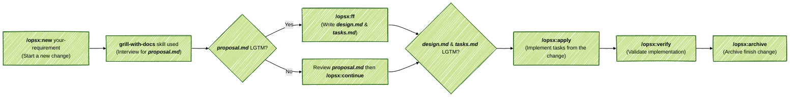

# SpecKit

**SpecKit** is a lightweight, opinionated, and AI-driven application development boilerplate. It provides out-of-the-box (OOTB) support for both Greenfield (new) and Brownfield (existing) projects with set of best practices. **What's included?**

- **[OpenCode](https://github.com/anomalyco/opencode)** - Model-agnostic agent orchestration.

  - [Oh-my-opencode-slim](https://github.com/alvinunreal/oh-my-opencode-slim) - Multi-Agent System (aka MAS) for OpenCode, with specialized agent team built-in to scan codebases, fetch docs, audit architecture, build UI, and run scoped implementation tasks via a single orchestrator.

- **[OpenSpec](https://github.com/Fission-AI/openspec)** - A spec-driven development framework with **an opinionated workflow** - `speckit`.

  

### 1. Installation

*Paste* the following instructions in `OpenCode`.

```text
Fetch and follow instructions from https://raw.githubusercontent.com/jimzhan/speckit/refs/heads/main/INSTALL.md
```
> [!TIP]
> Obtain your `OpenCode` API Key and [configure it](https://opencode.ai/docs#configure) (all configured API keys are stored in `$HOME/.local/share/opencode/auth.json`). It is recommended to start your test run with the free model provided by `OpenCode`.


### 2. End-to-End SpecKit Workflow



#### 2.1 Use

- `/opsx-explore` - to think through ideas before committing to a change (`/opsx-new` comes next).
- `/opsx-verify` - to validate implementation matches artifacts.
- `/opsx-update` - to revise a change's planning artifacts and keep them coherent.
- `/opsx-sync` - to merge delta specs into main specs:
  - `openspec/<change-id>/**/spec.md` => `openspec/specs/<domain>/spec.md`

> [!TIP]
> `/opsx-propose` generates full planning artifacts in a single pass without stakeholder interviews. To enforce rigorous requirement alignment and shared domain modeling, ***SpecKit*** intentionally disables this one-shot flow in favor of the interview-driven `grill-with-docs` skill from [mattpocock/skills](https://link.wtturl.cn/?target=https%3A%2F%2Fgithub.com%2Fmattpocock%2Fskills&scene=im&aid=582478&lang=zh).


### 3. Customization

#### 3.1 oh-my-opencode-slim

The default model is `opencode/deepseek-v4-flash-free` provided by `OpenCode`. To maximize the capabilities of your subscribed AI models, create a custom `oh-my-opencode-slim.json` to specify the model, variants, skills, and MCPs for each agent. Example:

```json
{
  "preset": "codex",
  "presets": {
    "codex": {
      "orchestrator": {
        "model": "openai/o3",
        "skills": ["*"],
        "mcps": ["*"]
      },
      "oracle": {
        "model": "openai/o3",
        "variant": "high",
        "skills": ["simplify"],
        "mcps": []
      },
      "librarian": {
        "model": "openai/o4-mini",
        "variant": "low",
        "skills": [],
        "mcps": ["websearch", "context7", "grep_app"]
      },
      "explorer": {
        "model": "openai/o4-mini",
        "variant": "low",
        "skills": [],
        "mcps": []
      },
      "designer": {
        "model": "openai/o4-mini",
        "variant": "medium",
        "skills": ["agent-browser"],
        "mcps": []
      },
      "fixer": {
        "model": "openai/o4-mini",
        "variant": "low",
        "skills": [],
        "mcps": []
      }
    }
  }
}
```


> [!TIP]
> Not included, but highly recommended:
>
> - [`rtk`](https://github.com/rtk-ai/rtk) - High-performance CLI proxy that reduces LLM token consumption by 60-90% (`rtk init -g --opencode `).


### 

