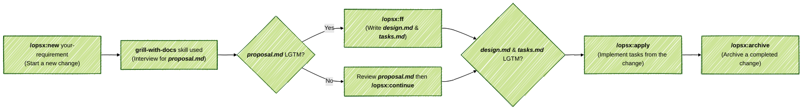

# CoKit

SpecKit is an opinionated, AI-driven application development boilerplate.


### Installation

- Tell OpenCode:

  ```
  Fetch and follow instructions from https://raw.githubusercontent.com/jimzhan/cokit/refs/heads/main/INSTALL.md
  ```


### Workflow


