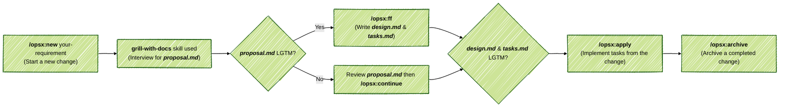

# SpecKit

**SpecKit** is a lightweight, opinionated, and AI-driven application development boilerplate. It provides out-of-the-box (OOTB) support for both Greenfield (new) and Brownfield (existing) projects. **What's included?**

- **[OpenCode](https://github.com/anomalyco/opencode)** - Model-agnostic agent orchestration.
- **[OpenSpec](https://github.com/Fission-AI/openspec)** - A spec-driven development framework with an opinionated workflow.
- **[Skills](https://github.com/mattpocock/skills)**
  - Real-world productivity skills powered by `mattpocock/skills` for `OpenSpec`.


### 1. Installation

#### 1.1 Instruct OpenCode to fetch and follow the setup instructions:

```text
Fetch and follow instructions from https://raw.githubusercontent.com/jimzhan/speckit/refs/heads/main/INSTALL.md
```

#### 1.2 Ensure at least one model provider is activated for `OpenCode`.

> 💡 **Tip:** It is recommended to start your test run with the free model provided by `OpenCode` (enabled by default if environment variable  `OPENCODE_API_KEY` is configured).


### 2. Workflow



#### 2.1 Use

- `/opsx-explore` - to think through ideas before committing to a change (`/opsx-new` comes next).
- `/opsx-verify` - to validate implementation matches artifacts.
- `/opsx-update` - to revise a change's planning artifacts and keep them coherent.
- `/opsx-sync` - to merge delta specs into main specs:
  - `openspec/<change-id>/**/spec.md` => `openspec/specs/<domain>/spec.md`


### Recommended Setup

- [`rtk`](https://github.com/rtk-ai/rtk) - High-performance CLI proxy that reduces LLM token consumption by 60-90% (`rtk init -g --opencode `).
